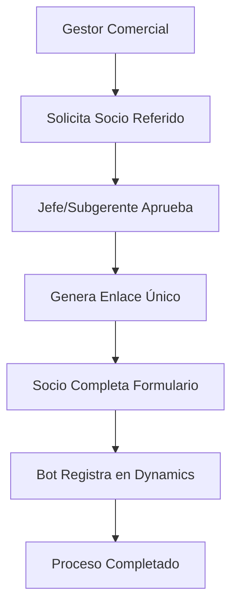

# Portal de Proveedores - Socio Referido

## 📋 Descripción del Proyecto

Sistema integral para la gestión automatizada de socios referidos que permite agilizar y controlar el proceso de solicitud, aprobación y registro desde el área comercial hasta la integración con el ERP Dynamics 365.

## 🎯 Objetivos Principales

- **Agilizar** el proceso de solicitud y registro de socios referidos
- **Integrar** aprobaciones del área comercial con flujo digital
- **Automatizar** el envío de enlaces de registro seguros
- **Cumplir** con requisitos legales y protección de datos personales
- **Facilitar** actualización de datos bancarios mediante enlaces únicos
- **Automatizar** registro en ERP Dynamics 365

## 🏗️ Arquitectura del Sistema

### Componentes Principales

| Componente | Tipo | Descripción |
|------------|------|-------------|
| Portal Web | Sistema Interno | Interfaz para gestores y aprobadores |
| ERP Dynamics | Sistema Externo | Registro automatizado de proveedores |
| Bot RPA | Automatización | Integración Portal → Dynamics |

### Flujo de Trabajo

## ⚙️ Funcionalidades Principales

### 🔄 Flujo de Solicitud y Aprobación
- Solicitud por parte del Gestor Comercial
- Sistema de aprobación por Jefe/Subgerente de Ventas
- Generación automática de enlaces únicos

### 📝 Registro de Información
- Formulario web accesible mediante enlace personalizado
- Captura de información personal y bancaria
- Validación de consentimiento informado (LOPD)
- Campos obligatorios con validaciones

### 🔄 Actualización de Datos
- Enlaces personalizados para actualización de cuentas bancarias
- Acceso mediante token único y temporal
- Solo modificación de datos financieros

### 📊 Consulta y Seguimiento
- Bandeja de consulta con filtros avanzados
- Exportación a Excel
- Permisos por perfil de usuario
- Seguimiento de estados de aprobación

### 🤖 Automatización RPA
- Registro automático en Dynamics 365
- Validación de existencia de proveedores
- Gestión de cuentas bancarias
- Tiempo de ejecución: 3-30 segundos

## 👥 Perfiles de Usuario

### Gestor Comercial
- Crear solicitudes de socio referido
- Consultar registros propios
- Acceso a formulario de registro

### Jefe/Subgerente de Ventas
- Aprobar/rechazar solicitudes
- Consultar todos los registros
- Generar enlaces de registro

### Socio Referido
- Completar formulario de registro
- Actualizar datos bancarios
- Acceso mediante enlace único

## 🛡️ Seguridad y Cumplimiento

- **Tokens únicos** para acceso a formularios
- **Validación LOPD** obligatoria
- **Permisos por perfil** de usuario
- **Enlaces temporales** con expiración
- **Protección de datos** personales y financieros

## 🔧 Tecnologías Utilizadas

- **Frontend**: Portal Web de Proveedores
- **Backend**: Sistema de gestión integrado
- **Automatización**: Bot RPA con Power Automate
- **ERP**: Microsoft Dynamics 365
- **Notificaciones**: Sistema de correo electrónico

## 📋 Requisitos del Sistema

### Datos Soportados
- **Documentos**: DNI, Carné de Extranjería
- **Cuentas**: Ahorro, Corriente
- **Moneda**: PEN (Soles Peruanos)
- **Bancos**: BCP, Interbank, Scotiabank, Pichincha, Caja

### Validaciones de Negocio
- Campos obligatorios en formularios
- Validación de formato de documentos
- Verificación de datos bancarios
- Consentimiento informado obligatorio

## 🚀 Instalación y Configuración

### Prerrequisitos
- Acceso al Portal de Proveedores
- Permisos en Dynamics 365
- Configuración de Bot RPA

### Configuración de Perfiles
1. Crear perfil "Gestor Comercial"
2. Crear perfil "Jefe/Subgerente de Ventas"
3. Configurar permisos por módulo

### Configuración del Bot
1. Configurar conexión a Dynamics
2. Establecer horarios de ejecución
3. Configurar notificaciones

## 📊 Campos de Registro en Dynamics

### Sección General
- Cuenta de proveedor
- Nombre y apellidos
- Grupo de proveedor
- Activación de colaboración

### Sección de Pago
- Condiciones de pago
- Forma de pago
- Cuenta bancaria asociada

### Sección Identificación Perú
- País/región
- Tipo de identificación
- Número de documento

### Cuentas Bancarias
- Datos completos del banco
- Tipo de cuenta
- Número de cuenta e información adicional

## 📈 Beneficios del Sistema

- ⏱️ **Reducción de tiempos** de procesamiento
- 🔄 **Automatización completa** del flujo
- 📧 **Notificaciones automáticas** por email
- 🛡️ **Cumplimiento normativo** garantizado
- 📊 **Trazabilidad completa** del proceso
- 🔍 **Consultas y reportes** avanzados
